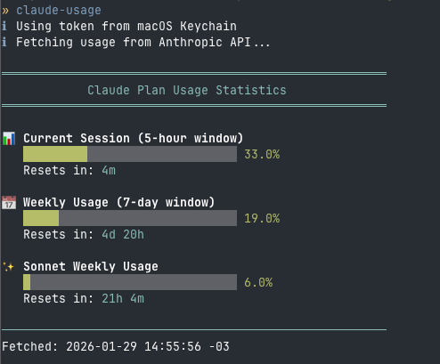

# claude-usage

A bash script to check your Claude Plan usage statistics via the Anthropic OAuth API.



## Prerequisites

- `curl` and `jq` installed
- [Claude Code](https://github.com/anthropics/claude-code) logged in (`claude login`)

## Installation

### Homebrew (recommended)

```bash
brew tap fm1randa/tap
brew install claude-usage
```

### Manual

```bash
git clone https://github.com/fm1randa/claude-usage.git
cd claude-usage
chmod +x claude-usage
sudo ln -s "$(pwd)/claude-usage" /usr/local/bin/claude-usage
```

## Usage

```bash
./claude-usage              # Full usage display with progress bars
./claude-usage -s           # Statusline format: "5h: 42% 7d: 18%"
./claude-usage -R           # Show remaining capacity instead of usage
./claude-usage -j           # JSON output for scripting
./claude-usage -r           # Raw API response
./claude-usage -t TOKEN     # Use specific OAuth token
```

### Custom Format

Use a format string with placeholders for flexible output:

| Placeholder | Description |
|-------------|-------------|
| `DD` | 5-hour (session) usage percentage |
| `WW` | 7-day (weekly) usage percentage |
| `RR` | Reset time (e.g., "3h 23m") |

```bash
./claude-usage "5d: DD% 7d: WW%"     # "5d: 65% 7d: 78%"
./claude-usage "resets in RR"        # "resets in 3h 23m"
./claude-usage -R "DD% left"         # "35% left" (remaining capacity)
./claude-usage "DD/100"              # "65/100" (custom symbol)
```

## Credential Sources

The script looks for OAuth tokens in this order:

1. `--token` argument
2. `CLAUDE_OAUTH_TOKEN` environment variable
3. macOS Keychain
4. `~/.claude/.credentials.json`

## Integration with ccstatusline

Works great as a custom command for [ccstatusline](https://github.com/sirmalloc/ccstatusline):

```bash
claude-usage -s   # outputs "5h: 42% 7d: 18%"
```


## Credits

Based on [CodexBar](https://github.com/steipete/CodexBar) by steipete.
