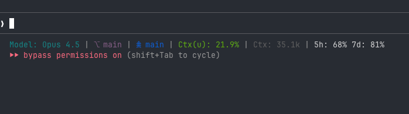

# claude-usage

A bash script to check your Claude Plan usage statistics via the Anthropic OAuth API.

## Prerequisites

- `curl` and `jq` installed
- [Claude Code](https://github.com/anthropics/claude-code) logged in (`claude login`)

## Installation

```bash
# Clone and make executable
git clone https://github.com/yourusername/claude-usage.git
cd claude-usage
chmod +x claude-usage
```

## Usage

```bash
./claude-usage              # Full usage display with progress bars
./claude-usage -s           # Statusline format: "5h: 42% 7d: 18%"
./claude-usage -R           # Show remaining capacity instead of usage
./claude-usage -j           # JSON output for scripting
./claude-usage -r           # Raw API response
./claude-usage -t TOKEN     # Use specific OAuth token
```

## Credential Sources

The script looks for OAuth tokens in this order:

1. `--token` argument
2. `CLAUDE_OAUTH_TOKEN` environment variable
3. macOS Keychain
4. `~/.claude/.credentials.json`

## Integration with ccstatusline

Works great as a custom command for [ccstatusline](https://github.com/sirmalloc/ccstatusline):

```bash
claude-usage -s   # outputs "5h: 42% 7d: 18%"
```



## Credits

Based on [CodexBar](https://github.com/steipete/CodexBar) by steipete.
